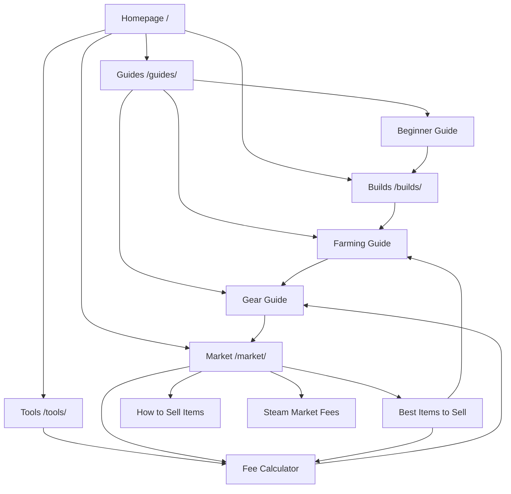

# War of Genesis — Phase 1 IA / SEO Plan

Status: implementation-ready planning artifact; no Phase 2 pages or tools are implemented by this document.

- Project: `[WoG] War of Genesis: Idle Loot`
- Domain: `https://war-of-genesis.wiki`
- Primary locale: `en`
- Baseline: `340b82ea5ed1c32fa4330d10540bbc0413e2b026`
- Planning date: `2026-09-15`

## A. Executive Summary

War of Genesis Wiki should launch as a focused decision-support product, not an encyclopedic database. Its first release should help a player move from progression choices to farming choices, gear decisions, market decisions, and a practical fee calculator without depending on live market data.

The recommended launch scope is **12 strategic product/SEO pages**: 10 P0 pages and 2 P1 pages. Two support pages are P2 and evidence-gated. The Codes page is deferred until the game's redemption system and at least one legitimate code source are verified. The inherited Search, About, Privacy, Terms, and 404 routes remain operational/supporting routes and are not counted in the 12-page product MVP.

The primary navigation is **Guides, Market, Builds, Tools**. Home remains accessible through the logo. Market owns the canonical Steam Market guide; Builds owns the canonical class/build decision page. This removes duplicate guide routes and prevents keyword cannibalization.

Launch requires no live Steam Market integration. All market guidance is static and source-aware. The calculator uses a versioned, verified fee policy and must stay unpublished if the applicable rate, rounding, minimum-fee, or currency behavior is not verified.

SEO opportunity and competition scores in this document are planning hypotheses based on the supplied product strategy, not measured search-volume findings. No first-party platform research, scraping, Steam Market API call, or competitor-data collection was performed in Phase 1.

## B. Product Positioning

**Final positioning:** War of Genesis Wiki is a decision-support wiki and practical toolset for `[WoG] War of Genesis: Idle Loot`, helping English-reading players make better farming, equipment, class/build, and Steam Market progression decisions.

The product promise is: **farm smarter, keep or sell with evidence, build for a goal, and understand expected Steam Wallet proceeds before listing.**

The site will not compete by publishing thousands of thin item, monster, stage, skill, or character pages. It will compete by connecting decisions that other resources often separate:

1. What progression goal matters now?
2. Where should the player farm for that goal?
3. Which drops support a build or deserve investment?
4. Which drops may be worth selling?
5. What will the player actually receive after verified Steam Market fees?

## C. Target User Jobs

| User job | Decision the site must enable | Best first destination |
| --- | --- | --- |
| Start efficiently | Choose a progression path without reading a generic game summary | `/guides/beginner-guide/` |
| Farm efficiently | Choose, test, and revisit a stage based on goal and observed results | `/guides/farming/` |
| Evaluate gear | Decide keep, equip, upgrade, synthesize, or sell | `/guides/gear/` |
| Choose a class/build | Compare play goals and stat/gear implications without unsupported tier claims | `/builds/` |
| Understand the market | Learn the game's Steam Market workflow, risks, and decision framework | `/market/` |
| Identify sell candidates | Prioritize item types for manual price checking without invented price rankings | `/market/best-items-to-sell/` |
| Estimate proceeds | Convert a buyer-facing listing price into an evidence-based net estimate | `/tools/steam-market-fee-calculator/` |
| Complete a listing | Follow the verified listing flow and avoid common category/game confusion | `/market/how-to-sell-items/` |

## D. SEO Intent Model

### Intent definitions

| Intent | What the searcher needs | Appropriate page behavior |
| --- | --- | --- |
| INFORMATIONAL | Understand a system or mechanic | Explain the verified rule, scope, and examples |
| DECISION | Choose between actions | Provide criteria, trade-offs, and a next step |
| TRANSACTIONAL / VALUE | Estimate or improve economic value | Lead to a calculation or market decision workflow |
| TROUBLESHOOTING | Resolve a specific failure | Publish only reproducible, sourced steps and escalation paths |
| FRESHNESS / UPDATE | Understand what changed | Summarize official changes and explain decision impact |
| NAVIGATIONAL | Reach the right section quickly | Use a concise hub with clear task-based paths |

### Priority scoring model

Each candidate receives a 1–5 score. A higher score is favorable for usefulness, SEO opportunity, differentiation, monetization value, and implementation speed. A higher score is unfavorable for freshness burden and competition difficulty. Scores are directional hypotheses; Phase 2 research must validate search demand and competitive difficulty with first-party platform/tool evidence before making market claims.

No weighted composite is used. P0 requires a direct fit with the core user journey and a credible evidence path. P1 adds launch value but can follow the essential decision loop. P2 waits for stronger evidence or an update process. DEFER means the page should not be published in the current MVP.

| Candidate route | Usefulness | SEO opportunity | Differentiation | Monetization value | Implementation speed | Freshness burden | Competition difficulty | Decision |
| --- | ---: | ---: | ---: | ---: | ---: | ---: | ---: | --- |
| `/` | 5 | 4 | 5 | 4 | 4 | 2 | 3 | P0 |
| `/guides/` | 4 | 3 | 3 | 3 | 4 | 1 | 3 | P0 |
| `/guides/beginner-guide/` | 5 | 4 | 3 | 2 | 3 | 3 | 4 | P0 |
| `/guides/farming/` | 5 | 5 | 5 | 4 | 2 | 4 | 4 | P0 |
| `/guides/steam-market/` | 5 | 4 | 5 | 5 | 3 | 4 | 3 | Merge into `/market/` |
| `/guides/gear/` | 5 | 4 | 5 | 5 | 2 | 4 | 4 | P0 |
| `/guides/classes/` | 4 | 4 | 3 | 2 | 2 | 4 | 5 | Merge into `/builds/` |
| `/market/` | 5 | 4 | 5 | 5 | 3 | 4 | 3 | P0 |
| `/market/best-items-to-sell/` | 5 | 5 | 5 | 5 | 2 | 5 | 4 | P0; framework, not price list |
| `/market/how-to-sell-items/` | 4 | 4 | 4 | 5 | 4 | 3 | 3 | P1 |
| `/market/steam-market-fees/` | 4 | 4 | 5 | 5 | 3 | 4 | 3 | P1 |
| `/tools/` | 4 | 3 | 4 | 4 | 4 | 1 | 2 | P0 |
| `/tools/steam-market-fee-calculator/` | 5 | 5 | 5 | 5 | 3 | 4 | 3 | P0 |
| `/classes/` | 4 | 4 | 3 | 2 | 2 | 4 | 5 | Remove; canonicalize at `/builds/` |
| `/builds/` | 5 | 4 | 4 | 3 | 2 | 4 | 5 | P0; one decision page |
| `/codes/` | 2 | 5 | 1 | 2 | 4 | 5 | 5 | DEFER pending verified utility |
| `/patch-notes/` | 3 | 3 | 3 | 2 | 2 | 5 | 4 | P2 |
| `/troubleshooting/` | 3 | 3 | 2 | 1 | 3 | 5 | 3 | P2 |

## E. Final Site Architecture

### Page hierarchy

```text
Homepage (/)
├── Guides (/guides/) [P0 hub]
│   ├── Beginner Guide (/guides/beginner-guide/) [P0]
│   ├── Farming Guide (/guides/farming/) [P0]
│   └── Gear Value & Keep-or-Sell Guide (/guides/gear/) [P0]
├── Market (/market/) [P0 hub + canonical Steam Market guide]
│   ├── Best Items to Sell (/market/best-items-to-sell/) [P0]
│   ├── How to Sell Items (/market/how-to-sell-items/) [P1]
│   └── Steam Market Fees (/market/steam-market-fees/) [P1]
├── Builds (/builds/) [P0 decision page]
├── Tools (/tools/) [P0 hub]
│   └── Steam Market Fee Calculator (/tools/steam-market-fee-calculator/) [P0]
├── Patch Notes (/patch-notes/) [P2, not launch]
├── Troubleshooting (/troubleshooting/) [P2, not launch]
└── Codes (/codes/) [DEFER]

Operational routes outside the strategic page count:
├── Search (/search/) [noindex]
├── About (/about/)
├── Privacy (/privacy/) [noindex]
├── Terms (/terms/) [noindex]
└── Not Found (/404.html) [noindex]
```

### Visual sitemap



## F. Launch MVP Page Map

Evidence codes are defined in Section P. “Static data” means reviewed, versioned repository data; it does not mean live ingestion.

| Priority | URL | Page Name | Primary Keyword / Query Cluster | Search Intent | User Job | Page Type | Evidence Requirement | Implementation Dependency | Freshness Burden | Differentiation | Monetization Potential | Phase |
| --- | --- | --- | --- | --- | --- | --- | --- | --- | --- | --- | --- | --- |
| P0 | `/` | War of Genesis Wiki Home | war of genesis wiki; war of genesis idle loot guide | NAVIGATIONAL / DECISION | Pick the next useful decision path | Home | E | CONTENT ONLY + STATIC DATA | Medium; reflects published set | High | High dwell potential | Launch |
| P0 | `/guides/` | War of Genesis Guides | war of genesis guides | NAVIGATIONAL | Find the right task guide | Hub | E | STATIC DATA | Low | Medium | Medium | Launch |
| P0 | `/guides/beginner-guide/` | War of Genesis Beginner Guide | war of genesis beginner guide; how to start | INFORMATIONAL / DECISION | Choose an early progression path | Guide | A + B + E | CONTENT ONLY | Medium; patch review | Medium | Medium | Launch |
| P0 | `/guides/farming/` | War of Genesis Farming Guide | best farming stage; AFK farming; fastest leveling; when to move stages | DECISION | Choose and re-evaluate a farming stage | Guide | B + C + E | CONTENT ONLY + STATIC DATA | High; patch-sensitive | High | High | Launch |
| P0 | `/guides/gear/` | Gear Value & Keep-or-Sell Guide | best gear; keep or sell items; useful stats; rarity | DECISION / TRANSACTIONAL / VALUE | Keep, use, upgrade, synthesize, or sell | Guide | B + C + E | CONTENT ONLY + STATIC DATA | High; patch-sensitive | High | High | Launch |
| P0 | `/builds/` | Classes & Builds Decision Guide | best class for beginners; class comparison; farming build | DECISION | Match a class/build direction to a goal | Decision guide | B + C + E | CONTENT ONLY + STATIC DATA | High; balance-sensitive | High | Medium | Launch |
| P0 | `/market/` | War of Genesis Steam Market Guide | war of genesis steam market; sell items on steam | INFORMATIONAL / DECISION / VALUE | Understand the market and choose the next market action | Hub + pillar guide | A + E | CONTENT ONLY + STATIC DATA | Medium-high; policy-sensitive | Very high | Very high | Launch |
| P0 | `/market/best-items-to-sell/` | Best Items to Sell | war of genesis best items to sell; valuable item types | DECISION / TRANSACTIONAL / VALUE | Decide which item types deserve manual market checking | Decision guide | B + C + E | CONTENT ONLY + STATIC DATA | High; never imply live ranking | Very high | Very high | Launch |
| P0 | `/tools/` | War of Genesis Tools | war of genesis tools; market calculator | NAVIGATIONAL | Reach the available decision tool | Hub | A + E | STATIC DATA | Low | High | High | Launch |
| P0 | `/tools/steam-market-fee-calculator/` | Steam Market Fee Calculator | steam market fee calculator; steam net proceeds calculator | TRANSACTIONAL / VALUE | Estimate seller proceeds before listing | Calculator | A + E | INTERACTIVE TOOL + STATIC DATA | High; fee-policy review | Very high | Very high / repeat visits | Launch |
| P1 | `/market/how-to-sell-items/` | How to Sell Items | how to sell war of genesis items; steam listing guide | INFORMATIONAL / TRANSACTIONAL | Complete a verified listing workflow | How-to guide | A + E | CONTENT ONLY | Medium; UI/policy-sensitive | High | High | Launch |
| P1 | `/market/steam-market-fees/` | Steam Market Fees Explained | steam market fees; how much steam takes | INFORMATIONAL / VALUE | Understand fees, rounding, minimums, and wallet proceeds | Explainer | A + E | CONTENT ONLY + STATIC DATA | High; policy-sensitive | High | High | Launch |
| P2 | `/patch-notes/` | Patch Notes & Decision Impact | war of genesis patch notes; updates | FRESHNESS / UPDATE | See official changes and their effect on decisions | Update hub | A + E | FRESH DATA | Very high | Medium | Medium | Later |
| P2 | `/troubleshooting/` | War of Genesis Troubleshooting | login failure; market item not received; map switching; raid access | TROUBLESHOOTING | Diagnose a verified known issue | Support hub | A + B + E | CONTENT ONLY | Very high; fixes age quickly | Medium | Low | Later |
| DEFER | `/codes/` | War of Genesis Codes | war of genesis codes; redeem codes | FRESHNESS / NAVIGATIONAL | Find legitimate active codes, if the game supports them | Freshness page | A + E | FRESH DATA | Very high | Low | Medium | Evidence-gated |

## G. P0 / P1 / P2 / DEFER Priorities

### P0 — launch-essential (10 pages)

1. `/`
2. `/guides/`
3. `/guides/beginner-guide/`
4. `/guides/farming/`
5. `/guides/gear/`
6. `/builds/`
7. `/market/`
8. `/market/best-items-to-sell/`
9. `/tools/`
10. `/tools/steam-market-fee-calculator/`

Together these pages complete the core loop: start → build goal → farm → evaluate gear → consider selling → calculate proceeds.

### P1 — high-value launch additions (2 pages)

1. `/market/how-to-sell-items/`
2. `/market/steam-market-fees/`

These deepen the market cluster and support calculator trust, but the calculator can carry concise fee methodology and listing warnings until both pages are ready.

### P2 — publish later (2 pages)

1. `/patch-notes/` only after an official-update monitoring and original impact-analysis workflow exists.
2. `/troubleshooting/` only after each issue has reproducible evidence or an official resolution/escalation path.

### DEFER

The Codes page and 16 additional product/data features are enumerated in Section T. Removed or merged URLs are not counted as deferred features.

## H. URL Structure

### Policy

- Use lowercase English words and hyphens.
- Enforce the Starter's existing trailing-slash convention for content routes.
- Keep strategic content at no more than two path segments.
- Let the path express ownership: `/market/.../` for market decisions, `/guides/.../` for general player guides, and `/tools/.../` for interactive tools.
- Do not include dates, patch numbers, IDs, or repeated game-name keywords in paths.
- Treat an established URL as permanent; update its content and `updatedAt` rather than creating patch-specific replacements.

### Removed, merged, or renamed candidate routes

| Candidate | Final handling | Reason |
| --- | --- | --- |
| `/guides/steam-market/` | Merge into `/market/` | The Market hub is also the canonical pillar guide; two pages would overlap intent. |
| `/guides/classes/` | Merge into `/builds/` | One strong comparison/decision page is more useful than a thin classes overview. |
| `/classes/` | Remove in favor of `/builds/` | Avoid two hubs targeting the same class/build comparison intent. |
| `/guides/getting-started/` | Rename to `/guides/beginner-guide/` before public launch | The final slug matches player language and the supplied candidate map. The site is not deployed, so no production redirect is currently required; add one only if the old URL becomes externally reachable. |

## I. Navigation

### Desktop header

The logo links to Home. The ordered primary navigation has four items:

1. **Guides** → `/guides/`
   - Beginner Guide
   - Farming Guide
   - Gear Guide
2. **Market** → `/market/`
   - Best Items to Sell
   - How to Sell Items
   - Steam Market Fees
3. **Builds** → `/builds/`
4. **Tools** → `/tools/`
   - Steam Market Fee Calculator

Search remains a utility control, not a fifth editorial category. Updates should not appear in the header until `/patch-notes/` has a sustainable update workflow and at least one useful impact analysis.

### Mobile navigation

Use the same order and labels. Guides, Market, and Tools use native expandable groups with a direct “Overview” link, matching the existing Starter navigation behavior. Builds is a direct link. Do not introduce mobile-only destinations.

### Footer

- **Start:** Beginner Guide, Farming, Gear, Builds
- **Market & Tools:** Market Guide, Best Items to Sell, Fee Calculator
- **Site:** Search, About
- **Legal:** Privacy, Terms

## J. Internal Linking

### Hub-and-spoke ownership

| Hub | Spokes | Required return links |
| --- | --- | --- |
| `/guides/` | Beginner, Farming, Gear | Every spoke links back to Guides and to its next decision step. |
| `/market/` | Best Items to Sell, How to Sell Items, Steam Market Fees | Every spoke links back to Market and to the calculator where relevant. |
| `/tools/` | Steam Market Fee Calculator | Calculator links back to Tools, Market, Fees, and Gear. |
| `/builds/` | No launch spokes | Links to Farming, Gear, and Market; do not create empty class pages. |

### Required user journeys

1. **Beginner → Builds → Farming → Gear → Market → Calculator**
2. **Market Guide → Best Items to Sell → Fee Calculator → Farming**
3. **Builds → Gear → Farming → Market**

Each page should contain one primary next-step CTA and two to four contextual links. Links use descriptive anchors such as “compare keep-or-sell criteria,” not “read more.” Every launch page must have at least one inbound contextual link in addition to navigation.

### Breadcrumbs

- `/guides/farming/`: Home → Guides → Farming Guide
- `/market/best-items-to-sell/`: Home → Market → Best Items to Sell
- `/tools/steam-market-fee-calculator/`: Home → Tools → Steam Market Fee Calculator
- `/builds/`: Home → Builds

The existing breadcrumb resolver uses published ancestor routes, so each child requires its published hub in Page Inventory. Breadcrumbs must be visible and emit the existing `BreadcrumbList` structured data.

## K. Market Strategy

### Static / guide-based MVP

The Market hub explains which War of Genesis items can legitimately participate in the Steam Market, how a player verifies marketability in the current UI, what wallet proceeds mean, and how market decisions interact with progression. It must distinguish verified facts, player-observed behavior, and editorial decision frameworks.

The launch cluster includes:

- A canonical Market pillar page.
- A “best items to sell” framework organized by item type, progression opportunity cost, demand signals to check, and replacement difficulty—not unsourced live-price rankings.
- A verified listing workflow.
- A fee/rounding explainer.
- A net-proceeds calculator driven by versioned static fee policy.

All price references are either clearly dated examples from an approved evidence set or omitted. The MVP does not claim current prices, volume, liquidity, or expected returns.

### Future live-data features

Live price ingestion, price history, sale volume, alerts, and arbitrage-like analysis remain deferred. They require source legality review, rate-limit and failure handling, currency normalization, data retention, update monitoring, and visible staleness states. None is a launch dependency.

## L. Farming Strategy

The Farming guide should answer:

- What goal is the player farming for: experience, progression unlocks, build materials, gear upgrades, or potentially marketable drops?
- What verified conditions unlock or constrain a stage?
- What observations indicate that the player should stay, move forward, or step back?
- How should active and AFK sessions be compared without pretending that one universal stage is best?
- How do gear quality, clear reliability, run time, inventory pressure, and market opportunity cost change the decision?

### Safe claims from verified mechanics

Official or reproducible sources may support stage unlock rules, displayed rewards, AFK rules, map-switching behavior, named resources, and documented caps. These can be published with source and patch dates.

### Claims requiring player/data evidence

“Best stage,” fastest leveling, drop rate, drops per hour, expected value, optimal AFK duration, and when a specific build should move stages require repeated measurements across players/builds or a validated structured dataset. Until that evidence exists, the guide provides a measurement worksheet and decision process, not numerical rankings.

## M. Gear / Item Strategy

The MVP uses one comprehensive Gear Value & Keep-or-Sell guide. Its decision sequence is:

1. Confirm item type, rarity, bound/marketable state, and upgrade/synthesis use from verified sources.
2. Evaluate build fit and useful stats.
3. Estimate replacement difficulty and near-term progression value.
4. Check whether the item type warrants a manual market check.
5. Compare expected wallet proceeds with the item's progression opportunity cost.
6. Choose equip, keep, upgrade/synthesize, sell, or revisit later.

The page may use compact static tables only when the values have provenance, patch dates, and a named review owner. It must not imply that rarity alone determines value.

Structured item pages become worthwhile only after all four gates pass:

- First-party search/community evidence shows repeat demand for specific items.
- A structured source-backed dataset covers the decision-relevant attributes consistently.
- Each proposed page can offer a distinct decision, use case, or comparison beyond a templated fact card.
- The project has an update owner and automated validation for patch-sensitive records.

After those gates pass, begin with a reviewed pilot of 10–20 high-demand items. Do not bulk-generate the remaining catalog from sparse rows.

## N. Classes / Builds Strategy

Launch with one `/builds/` decision page, not one page per class. It should cover:

- Best starting direction by player goal, without declaring an unsupported universal winner.
- Class/build trade-offs for farming reliability, speed, gear dependence, and market-oriented progression.
- How useful stats and gear choices change by build goal.
- A build decision framework and a short respec/re-evaluation checklist if the game supports those mechanics and the source verifies them.

Class-specific pages require verified mechanical differences, a distinct user query, sufficient build evidence, and a maintenance owner. Tier rankings require multi-source or structured performance evidence and must show scope, patch, assumptions, and sample limitations. No tier ranking is approved for launch.

## O. Steam Market Fee Calculator Spec

### Identity and intent

- **URL:** `/tools/steam-market-fee-calculator/`
- **SEO title concept:** `Steam Market Fee Calculator for War of Genesis`
- **Primary query cluster:** `steam market fee calculator`, `steam net proceeds calculator`, `war of genesis market fees`
- **Intent:** TRANSACTIONAL / VALUE
- **Primary action after result:** compare the net estimate with the Gear keep-or-sell framework.

### Inputs

1. **Buyer-facing price per item** — required decimal amount in the single configured market currency.
2. **Quantity** — required integer, default `1`, accepted range `1–999`.

The supported currency and policy version are displayed, not silently inferred. Currency switching, live item lookup, purchase price, profit, ROI, tax, and exchange-rate inputs are outside MVP scope.

### Outputs

1. Buyer pays per item.
2. Estimated Steam fee per item.
3. Estimated game/publisher fee per item, when a verified game-specific fee applies.
4. Estimated total fees per item.
5. Estimated seller proceeds per item.
6. Estimated seller proceeds for the selected quantity.
7. Effective fee percentage and the fee-policy “last verified” date.

Every result is labeled **estimate**. The Steam confirmation/listing interface remains authoritative.

### Assumptions and calculation contract

- The calculator accepts the displayed buyer-facing amount, not a desired seller-receives amount.
- One listing price is applied to every unit in the quantity.
- The formula uses a versioned static policy containing supported currency, minor unit, Steam rate, applicable game/publisher rate, minimum fee components, calculation direction, and rounding order.
- Each fee component is calculated and rounded exactly in the order documented by the verified source; rounding only the final percentage is not acceptable.
- Wallet proceeds are not cash proceeds. Taxes, foreign exchange, account restrictions, listing eligibility, and future price movement are excluded.
- Phase 1 intentionally specifies no fee percentage or minimum amount because no fee-policy source was collected in this phase. The tool must remain draft and non-indexable until every policy field above is verified.

### Validation and failure behavior

- Reject blank, non-numeric, non-finite, negative, or zero prices.
- Accept only the configured currency's permitted number of decimal places.
- Enforce the verified currency-specific market minimum and a documented safe maximum.
- Accept quantity only as an integer from `1` through `999`.
- Do not calculate if the policy is missing, expired by its review interval, or internally inconsistent.
- Show a plain-language inline error; never coerce invalid input into a plausible result.
- Preserve shareable state in the URL fragment only after validation; no server request or personal data is required.

### Disclaimers

- Estimate only; verify the final amount in Steam before confirming a listing.
- Fee rules, rounding, minimums, eligible items, and currencies can change.
- Steam Wallet funds are subject to Steam's terms and are not represented as withdrawable cash.
- War of Genesis Wiki is independent and is not affiliated with or endorsed by Valve or the game publisher.

### Internal links

Inbound links: Home, Market, Best Items to Sell, Steam Market Fees, Gear, and Tools. Outbound links: Steam Market Fees, Gear, Best Items to Sell, Market, and the verified official fee-policy source.

### Future extensibility

Future versions may add verified currency policies, an inverse target-proceeds mode, item-price prefill from an approved live source, and dated comparisons. These must extend the policy model rather than hard-code rates in the UI.

The current Starter calculator contract supports bounded numeric inputs, a scalar result, and continuous arithmetic. This calculator needs multiple labeled outputs plus currency-specific minimums and ordered rounding. Phase 2 should extend the calculator definition/evaluator or implement a focused fee-calculator contract; it should not approximate fee behavior with the current generic percentage formula.

## P. Evidence Requirements

### Classification

- **A. OFFICIAL SOURCE ENOUGH:** a current official page, in-game UI, or publisher/Valve documentation can establish the fact.
- **B. PLAYER EXPERIENCE NEEDED:** the claim depends on real play behavior, workflow, or observed outcomes.
- **C. STRUCTURED GAME DATA NEEDED:** the claim compares repeatable values across stages, stats, classes, or items.
- **D. LIVE MARKET DATA NEEDED:** the claim concerns current price, volume, liquidity, or alerts.
- **E. MULTI-SOURCE VERIFICATION NEEDED:** a recommendation or sensitive workflow must reconcile official facts with more than one independent observation/source.

The Launch MVP Page Map classifies every launch page. No launch page requires D because live price claims are excluded. If a proposed claim requires D, omit that claim or defer the feature rather than presenting stale data as current.

### Publication rules

- Separate factual mechanics from editorial advice in the article structure.
- Record source URL, source type, access date, evidence note, confidence, and patch/version where applicable.
- Give patch-sensitive pages a named review trigger; do not rely only on a calendar date.
- Treat player reports as observations, not official rules.
- Require A + E before publishing fees, listing steps, eligibility, code status, or account-impacting troubleshooting.
- Require B + C + E before publishing “best,” “fastest,” drop-rate, expected-value, or tier claims.

## Q. Implementation Dependency Map

| P0 page | Dependency | Fresh-data dependency at launch? | Starter V2.6.5 readiness note |
| --- | --- | --- | --- |
| `/` | CONTENT ONLY + STATIC DATA | No | Existing homepage is inventory-driven; adjust hierarchy and featured IDs. |
| `/guides/` | STATIC DATA | No | Existing guides hub can list published guide inventory. |
| `/guides/beginner-guide/` | CONTENT ONLY | No | Existing guide route works after the pre-launch slug change. |
| `/guides/farming/` | CONTENT ONLY + STATIC DATA | No | Existing MDX guide pattern works; evidence tables may use reviewed static data. |
| `/guides/gear/` | CONTENT ONLY + STATIC DATA | No | Existing MDX guide pattern works; do not enable the item database. |
| `/builds/` | CONTENT ONLY + STATIC DATA | No | New top-level editorial route capability is required; current guide routes enforce `/guides/`. |
| `/market/` | CONTENT ONLY + STATIC DATA | No | New Market hub/editorial route capability is required. |
| `/market/best-items-to-sell/` | CONTENT ONLY + STATIC DATA | No | New Market spoke routing is required; no live ranking. |
| `/tools/` | STATIC DATA | No | New tools hub route is required; current tool route supports only `/tools/{slug}/`. |
| `/tools/steam-market-fee-calculator/` | INTERACTIVE TOOL + STATIC DATA | No | Tool shell exists, but the fee policy, ordered rounding, and multi-output model require focused extension. |

No P0 page requires FRESH DATA or USER-GENERATED DATA. Page Inventory remains the publication source of truth; content, facts, and tool definitions do not create routes on their own.

### Minimal architecture change for Phase 2

The smallest maintainable approach is to add explicit `market` and `builds` editorial capabilities plus a Tools hub, while retaining Page Inventory as the publication authority. Avoid teaching the existing Guides resolver to accept arbitrary top-level routes; its `/guides/` invariant is intentional. Add tests before enabling any new public page type/module, and keep all new inventory rows draft until their route, content, and evidence dependencies are ready.

## R. Monetization-Aware Page Assessment

Ads remain disabled. This table is for future product economics only; it does not authorize ad slots, analytics, or tracking.

| Page/group | Dwell time | Repeat visits | Commercial/value intent | Tool engagement | Planning implication |
| --- | --- | --- | --- | --- | --- |
| Home | Medium | Medium | Medium | Medium | Route quickly to high-value tasks; avoid a long game introduction. |
| Beginner Guide | High | Low-medium | Low | Low | Trust and onward-navigation page. |
| Farming Guide | High | High | Medium-high | Medium | Strong repeat-use candidate if updates remain credible. |
| Gear Guide | High | High | High | High | Best bridge between progression and market value. |
| Builds | High | Medium-high | Medium | Medium | Retention page; link strongly to Gear and Farming. |
| Market hub | High | High | Very high | High | Core differentiator and strongest commercial/value intent. |
| Best Items to Sell | Very high | High | Very high | Very high | Highest-value decision page, but also highest freshness risk. |
| How to Sell Items | Medium-high | Low-medium | Very high | High | Strong task completion intent. |
| Steam Market Fees | High | Medium | Very high | Very high | Trust/support page for the calculator. |
| Tools hub | Low-medium | High | High | Very high | Fast repeat access; keep concise. |
| Fee Calculator | High | Very high | Very high | Very high | Primary repeat-visit utility. |

## S. Phase 2 Build Order

1. **Build the evidence pack first.** Verify official game identity, market eligibility, Steam fee policy, currency behavior, listing workflow, and the source/patch fields needed by the first articles. Keep affected pages draft.
2. **Add failing capability tests.** Cover Market hub/spokes, the top-level Builds page, the Tools hub, breadcrumb ancestry, inventory validation, and exact route output before changing schemas or routes.
3. **Add the minimum route capabilities.** Introduce explicit Market and Builds editorial ownership plus a Tools hub without weakening the existing Guides route invariant.
4. **Register draft Page Inventory rows and navigation.** Add all 12 strategic pages as draft/non-indexable until each content and development gate passes; configure Guides, Market, Builds, and Tools groups by Page ID.
5. **Reshape the homepage and hubs.** Implement the task-first homepage hierarchy, Guides hub, Market hub, and Tools hub using enabled-catalog data.
6. **Replace the Phase 0 getting-started stub.** Publish the evidence-backed Beginner Guide at `/guides/beginner-guide/` and remove the undeployed placeholder route.
7. **Publish the Market pillar and fee methodology.** Establish market boundaries and the static policy model before exposing any calculation.
8. **Implement the calculator with tests.** Test component fees, rounding order, minimums, validation, quantities, stale/missing policy behavior, URL-fragment state, accessibility, and multi-output rendering; publish only after policy verification.
9. **Publish the Farming guide.** Use verified mechanics and a measurement framework; omit unsupported rates and universal “best stage” claims.
10. **Publish the Gear guide and Best Items to Sell page.** Reuse one reviewed static decision model and cross-link it to Farming, Market, and the calculator.
11. **Publish the Builds decision page, then the two P1 Market spokes.** Keep class-specific and tier pages disabled; add How to Sell and Steam Market Fees after their UI/policy evidence is current.
12. **Run the full release gate.** Validate no orphan pages, breadcrumbs, canonicals, sitemap/indexability, Pagefind, source rendering, mobile navigation, no ad output, exact build reconciliation, and all repository tests before any separate deployment authorization.

## T. Explicit Deferred Scope

The deferred page/feature count is **17**:

1. `/codes/` until a legitimate game-specific redemption system and source are verified.
2. Live Steam Market crawler or API integration.
3. Historical pricing database.
4. Sale-volume database.
5. Real-time price alerts.
6. Arbitrage-style features.
7. Thousands of item pages.
8. Thousands of monster/stage pages.
9. Community build voting.
10. User accounts or login.
11. User-generated content.
12. Multilingual expansion.
13. Advanced DPS calculator.
14. Farming profit/expected-value calculator.
15. Equipment comparator.
16. Build sharing.
17. P2W value calculator.

The separate `/classes/`, `/guides/classes/`, and `/guides/steam-market/` candidates are removed/merged URL concepts, not deferred products. Patch Notes and Troubleshooting are P2 pages, not part of this defer count.

## U. Risks / Findings

### P0 findings

None.

### P1 findings

None.

### P2 findings

1. **Demand evidence is not yet collected.** Search opportunity and competition scores are hypotheses. First-party platform and keyword-tool samples are required before treating them as market-size conclusions.
2. **The Starter lacks three planned route capabilities.** `/market/.../`, `/builds/`, and `/tools/` need explicit, tested Phase 2 support; current Guides and Tools resolvers cannot publish those exact structures unchanged.
3. **The generic calculator contract is insufficient for precise Steam fees.** It currently returns one scalar and lacks currency-policy minimums, ordered rounding, and multiple fee outputs.

### NIT findings

1. Rename the undeployed `/guides/getting-started/` placeholder before public launch so the final URL is not changed after indexing.

### Risk controls

- **Game confusion:** every Codes, troubleshooting, and market source must explicitly identify `[WoG] War of Genesis: Idle Loot`, not `War of Genesis: Idle Heroes`.
- **False precision:** no fee rate, drop rate, price, volume, or efficiency number is published without the required evidence class and date.
- **Staleness:** market, farming, gear, build, patch, and troubleshooting pages receive explicit review triggers.
- **Thin content:** new entity/class pages are blocked by the thresholds in Sections M and N.
- **Scope leakage:** live data, accounts, UGC, ads, deployment, and bulk generation remain outside Phase 2 MVP.

## V. Verdict

**PASS — WAR OF GENESIS PHASE 1 IA / SEO PLAN**

The baseline was intact before the planning artifact was created. The final IA, exact 12-page launch list, URL policy, intent map, evidence model, internal links, navigation, calculator scope, dependency map, defer list, and Phase 2 order are defined. P0 findings: 0. P1 findings: 0. No runtime implementation, live research integration, ads, deployment, commit, or push occurred.

## W. Exact Next Step

Human-review and approve this document. After approval, authorize a separate Phase 2 task whose first deliverable is a source/evidence pack for Steam fee mechanics, War of Genesis market eligibility, and the listing workflow, followed by failing route-capability tests. Do not enable the Market or calculator pages until that evidence pack passes review.

## Required Output Snapshot

1. **Verdict:** PASS — WAR OF GENESIS PHASE 1 IA / SEO PLAN
2. **Actual pwd:** `/Users/randyz/work/coding/hot_words_web/gameweb/game_warofgenesis`
3. **HEAD:** `340b82ea5ed1c32fa4330d10540bbc0413e2b026`
4. **Working Tree Clean Before Phase 1?** Yes
5. **Final Positioning:** War of Genesis: Idle Loot decision-support wiki and practical tools for farming, gear value, class/build, and Steam Market decisions
6. **Launch MVP Page Count:** 12 strategic product/SEO pages
7. **P0 Page Count:** 10
8. **P1 Page Count:** 2
9. **P2 Page Count:** 2, post-launch and evidence-gated
10. **Deferred Page/Feature Count:** 17
11. **Final Top-Level Navigation:** Guides | Market | Builds | Tools
